DigitalOcean 是什麼呢？ 
它是雲端主機 又稱vps
好處就是可以快速建立linux環境
而且cp值很高

----
<!--more-->

## 架設DigitalOcean事前準備工具

1. 有刷卡功能的金融卡or信用卡
2. 良好的電腦環境 
3. 愉快的心情
4. cunpon (很重要)
----

## 主要概要
1. 註冊帳號
2. 生成vps
3. 產生SSH-Key
4. 連線測試
5. 後續架設
----

## 廢話不多說就直接進入主題吧

到DigitalOcean註冊帳號
下面有兩個連結自行點選
過程需要綁定信用卡，初期建造時不會收到錢，後續則看您的專案選擇方案

> * 免費10元美金註冊網址 ： <a href="https://m.do.co/c/88588aa67338">免費10元喔～</a>
> * DigitalOcean官網：<a href="https://www.digitalocean.com/">DigitalOcean</a>

### 1.安裝VPS

註冊完後進入DigitalOcean
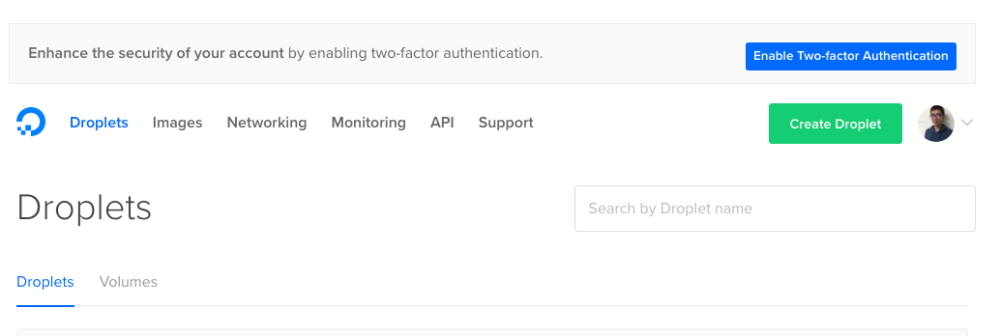
點選Create Droplet 

這裡我選ubuntu 16.04
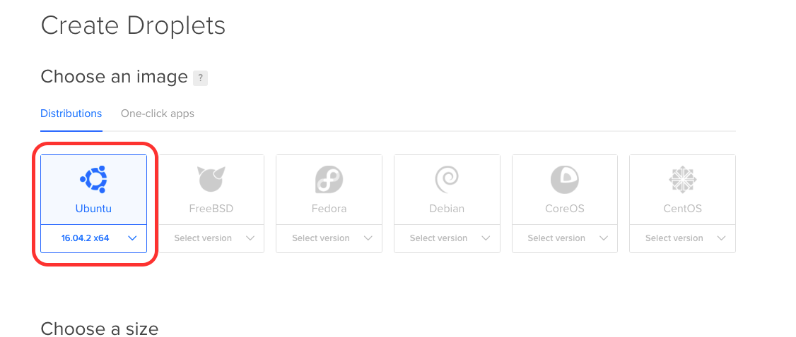
這裡依照個人選擇主機規格（建議先選5美元，DigitalOcean主機只能高升不能低降）
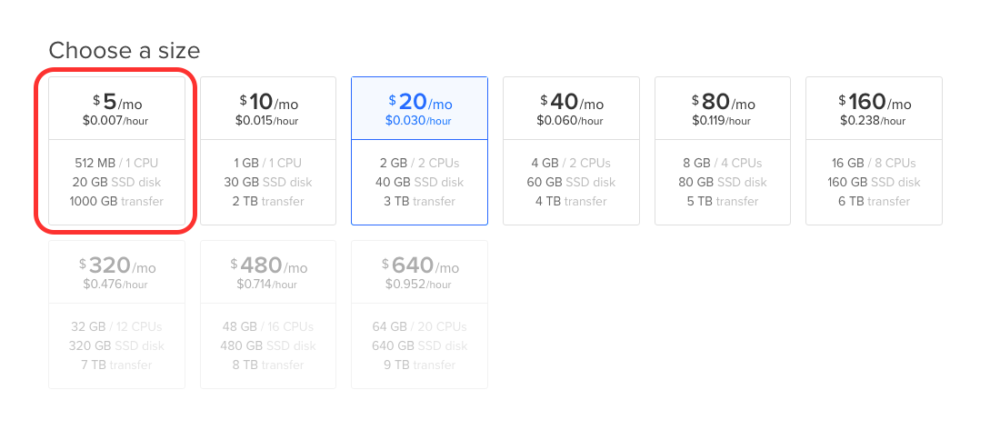
選擇主機位置，由於屬於亞洲地區，建議選擇 Singapore
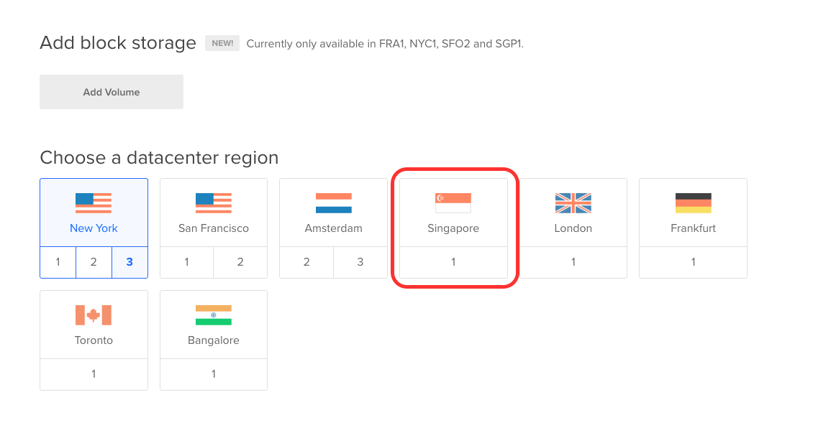
接下來屬於本單元最大的重點 SSH-Keys 下節再回來講如何設定
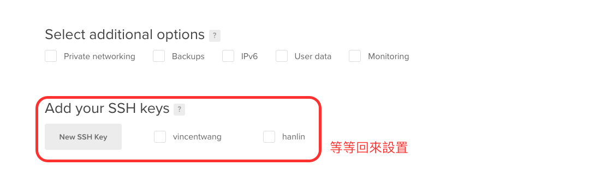
更改主機名稱 
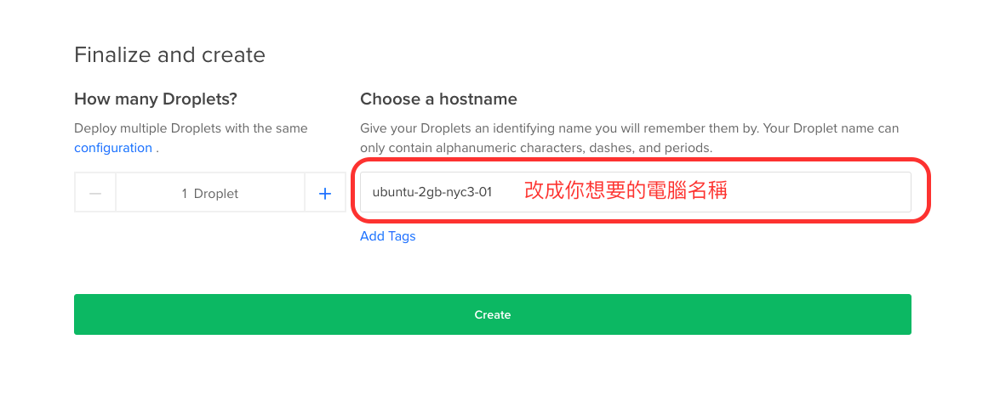
先不要按create喔 還要設定SSH-Key

### 2.設定SSH-Key 

到terminal輸入
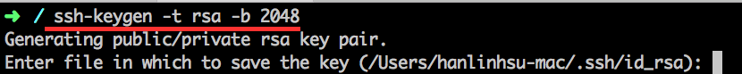
```
$ ssh-keygen -t rsa -b 2048
```
接下來三下Enter 
會看到這個圖案
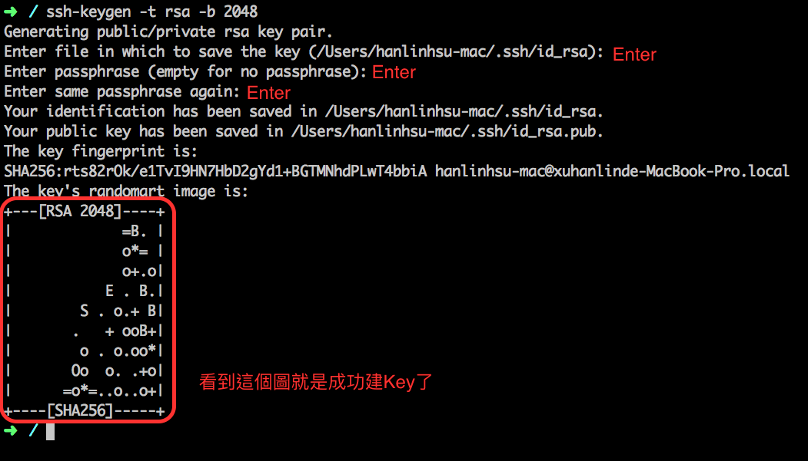
cd到.ssh資料夾
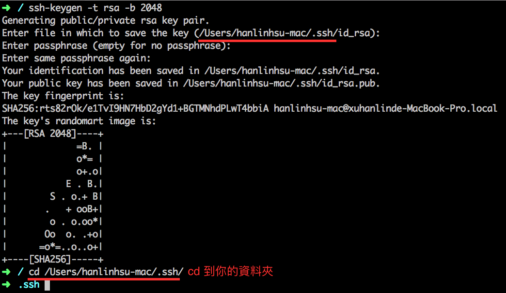
```
$ cat id_rsa.pub
```
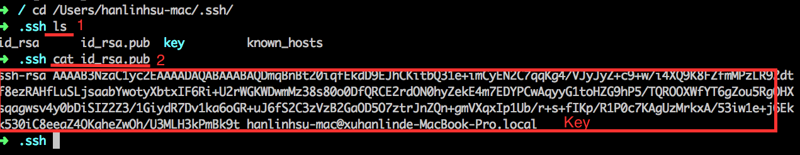
將Key複製，回貼到New SSH Key
輸入名稱
點選Add SSH KEY
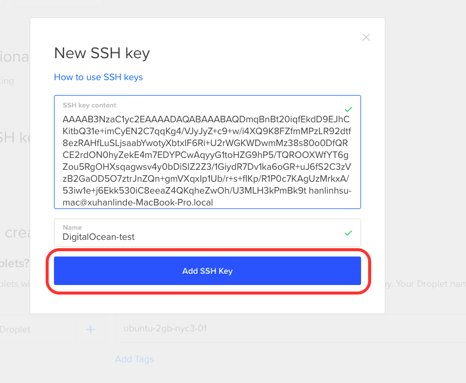
會看到你以建好SSH Key
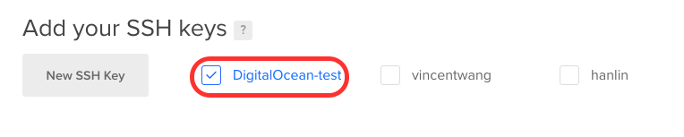
按下create

### 3.連線測試 

等待vps建立  
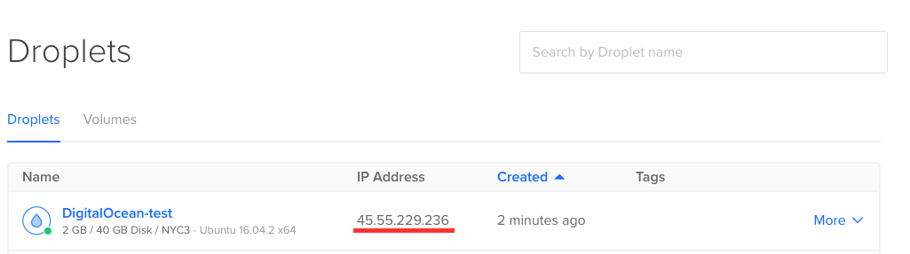
vps建立完成 回到到terminal進行遠端連線
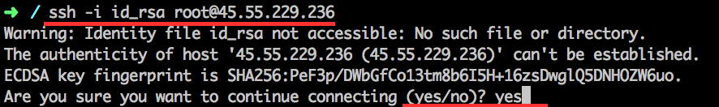
```
$ ssh -i id_rsa root@"vps-ip"
```
輸入yes 

連線成功
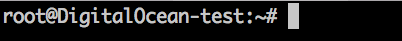
接下來就可以自行進行後續Server設置


