今天使用了hexo來架blog
第一次安裝hexo＋GitHubNext主题就上手-MAC篇
<!--more-->
今天使用了hexo來架blog
第一次安裝hexo＋GitHubNext主题就上手-MAC篇
前置作業：
一台MAC
GitHub帳號 如果還沒有可以到GitHub註冊

簡易流程：
1. 環境設置：
    * install Homebrew
    * install nvm
2. 安裝hexo
3. 上傳到GitHub
4. 更改theme

## 1. 環境設置
### 第一步安裝brew
>brew官網  http://brew.sh/

#### 安裝指令

```
$ /usr/bin/ruby -e "$(curl -fsSL  https://raw.githubusercontent.com/Homebrew/install/master/install)"
```
貼到終端機中
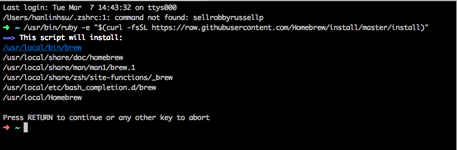
安裝完後輸入brew --version查看有無安裝成功
### 第二步安裝nvm
#### 安裝指令
```
$ brew install nvm
```
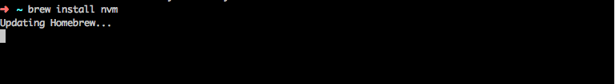
安裝完後輸入node --version查看有無安裝成功

## 2. 安裝hexo
```
$ npm install -g hexo-cli
```
初始化框架
```
$ hexo init blog
```
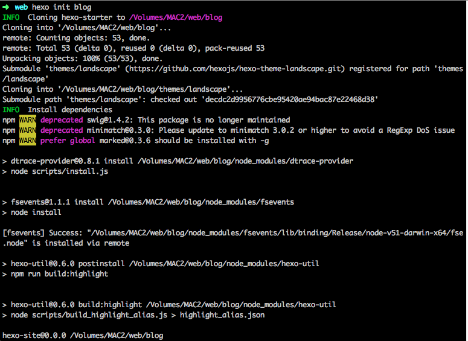
```
$ cd
$ npm install
$ hexo server
```
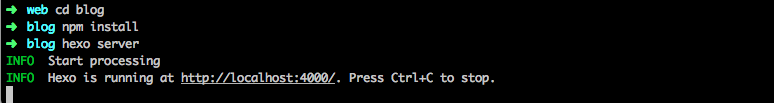
打開`127.0.0.1:4000`
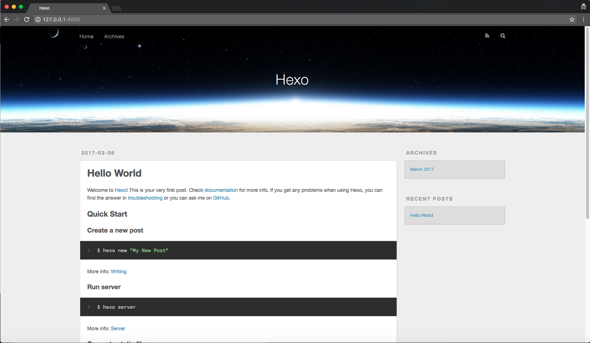

## 3. 上傳到github
#### 建立新的 repo
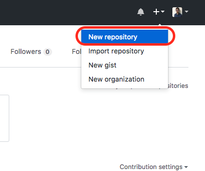
#### 更改repo名字
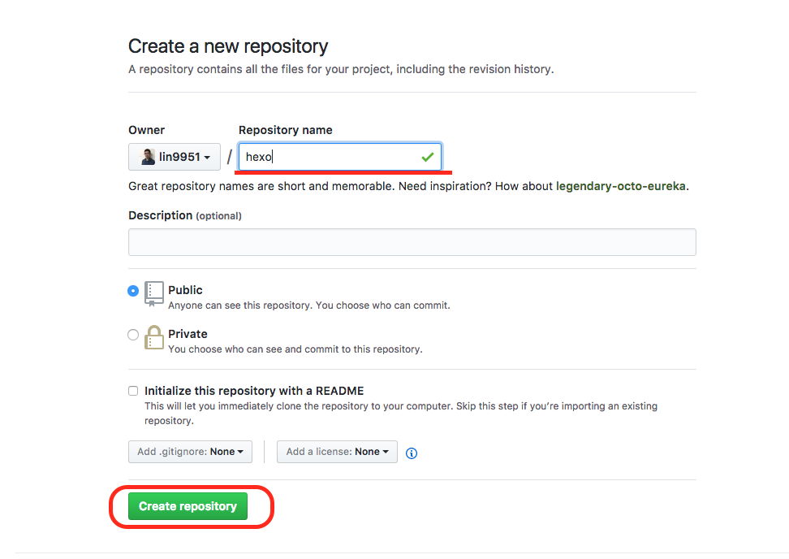
#### 建立完成，跳到設定 setting (在最上面那排wiki旁邊點一下)
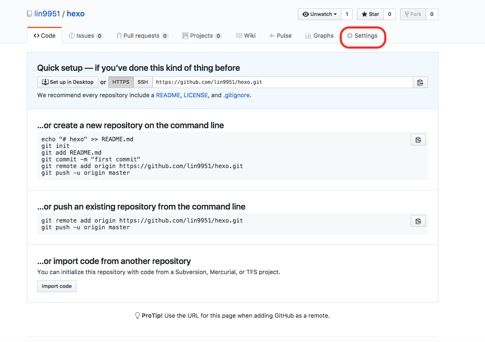
#### Setting裡面有Theme chooser，點選choose a theme
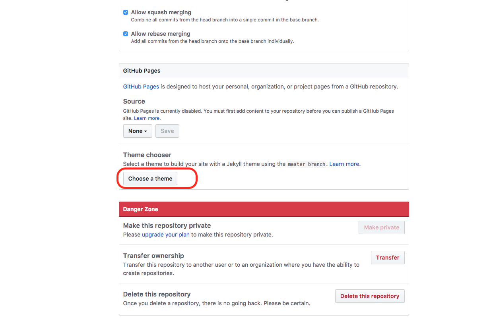
#### 隨便選一個拉~到時候要用Hexo覆蓋掉選完點選「Select theme」
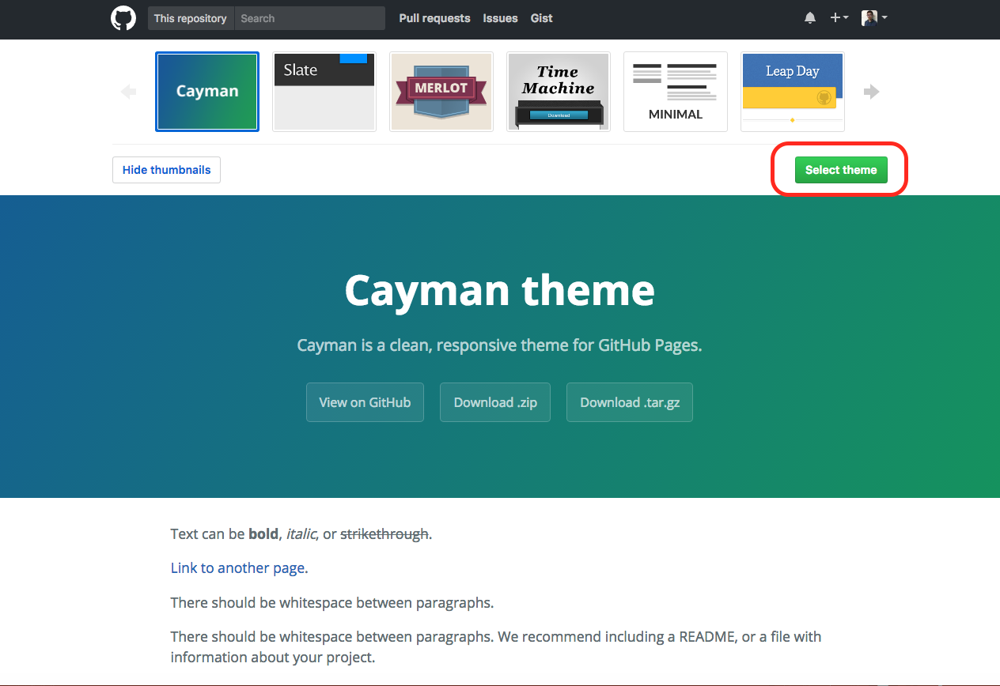
#### 拉到最下面 cmmit changes，完成建立github pages
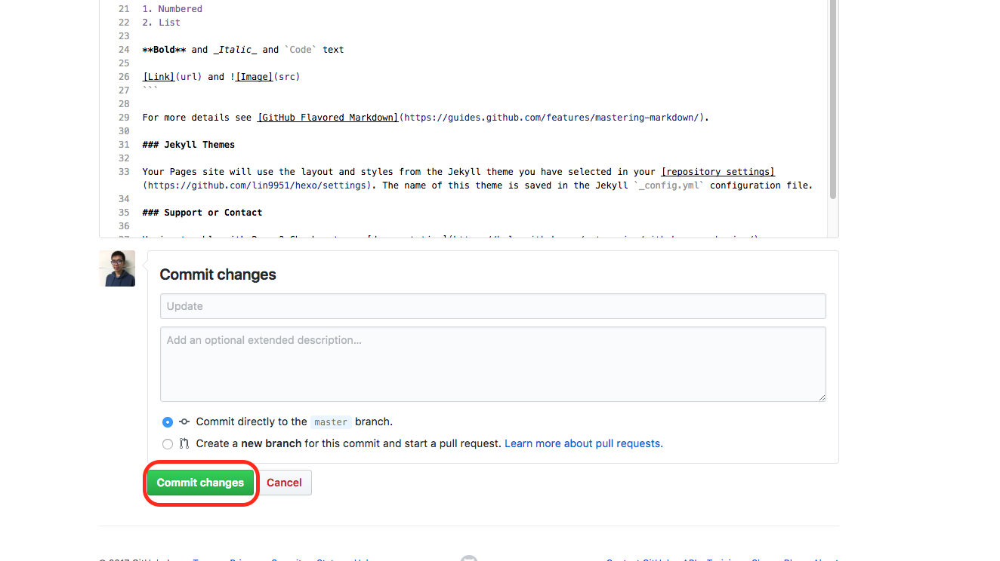
#### 回到Repo，新增一個「gh-pages」的branch
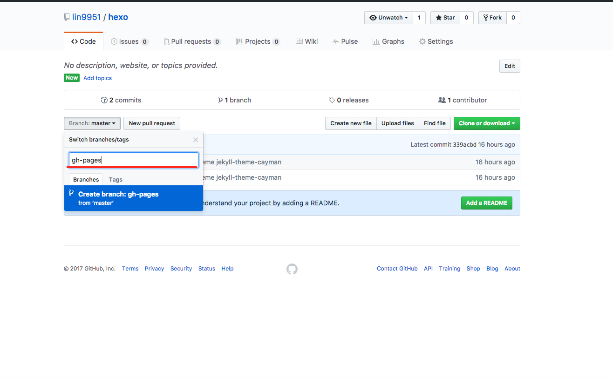
#### 回到設定，左邊選單出現Branches，在Default branch的地方選擇「gh-pages」，然後update
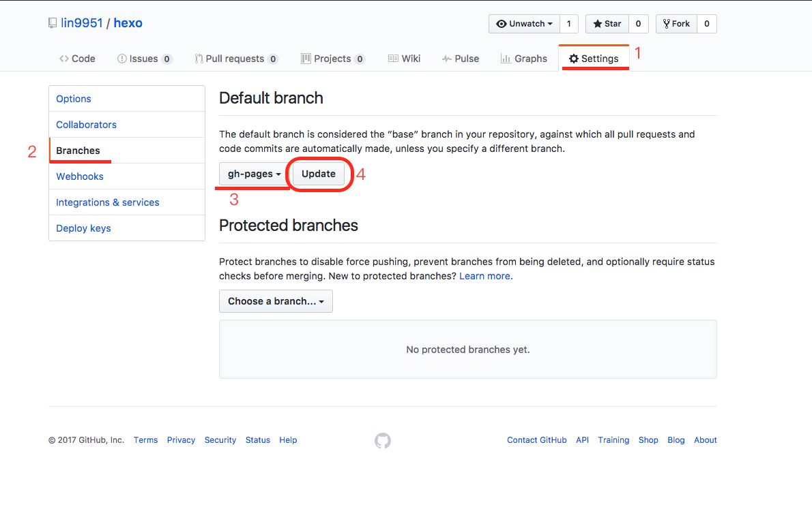
#### 回到setting的option的下方，在source的地方選擇gh-pages branch，選擇「save」
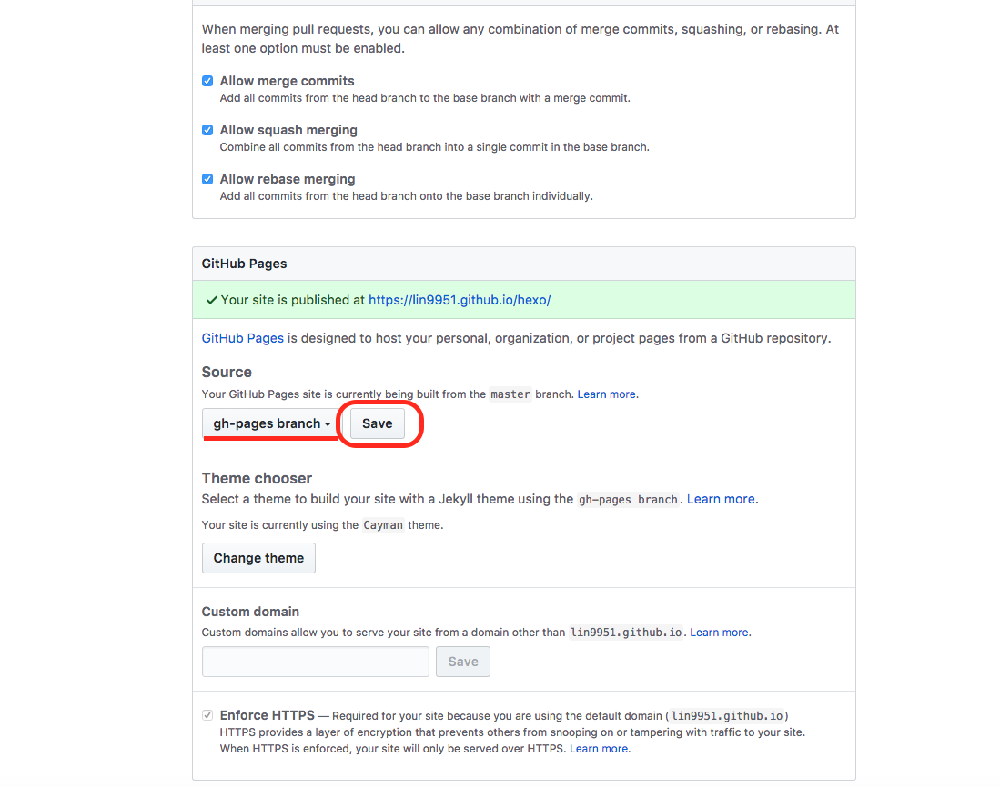
### 回到終端機
#### 指令1. 將專案加入git (為了要把檔案全部推到git master)
```
$ git init
```
#### 指令2. 使用git remote add的語法將本資料夾加入遠端git的repo
```
$ git remote add origin [github repo]
```
#### 指令3
```
$ git add .
```
#### 指令4
```
$ git commit –m “upload hexo”
```
-------
### 在hexo 資料夾底下 將_config.yml修改以下地方
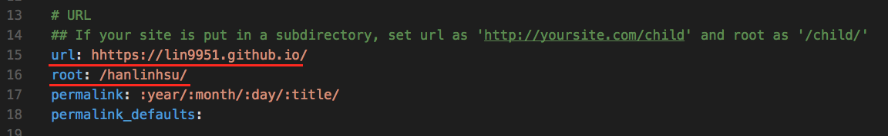
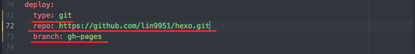

### 安裝hexo deployer
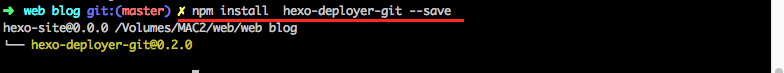
#### 接下來輸入指令
```
$ hexo cl
$ hexo g
$ hexo d
```
#### 就可以將檔案部署到github上面了
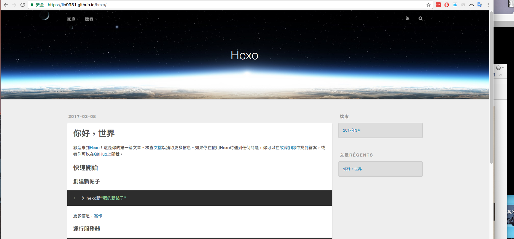

## 4. 更改heox theme
##### 這裡有很多hexo的主題: https://hexo.io/themes/
##### 今天範例next 主題轉換
##### next theme 文檔 http://theme-next.iissnan.com/
### 輸入指令
```
$ git clone https://github.com/iissnan/hexo-theme-next themes/next
```
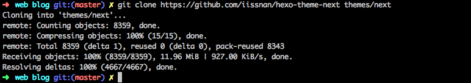
#### 到hexo 資料夾底下 將_config.yml修改以下地方
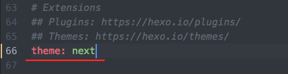
#### 接下來輸入指令
```
$ hexo cl
$ hexo g
$ hexo d
```
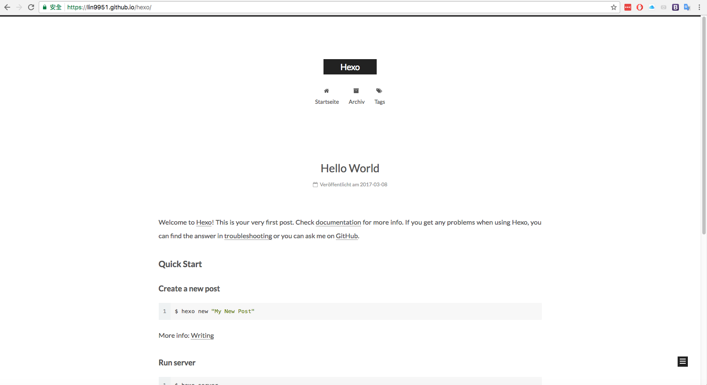
#### 重新上傳 網站就更新了
